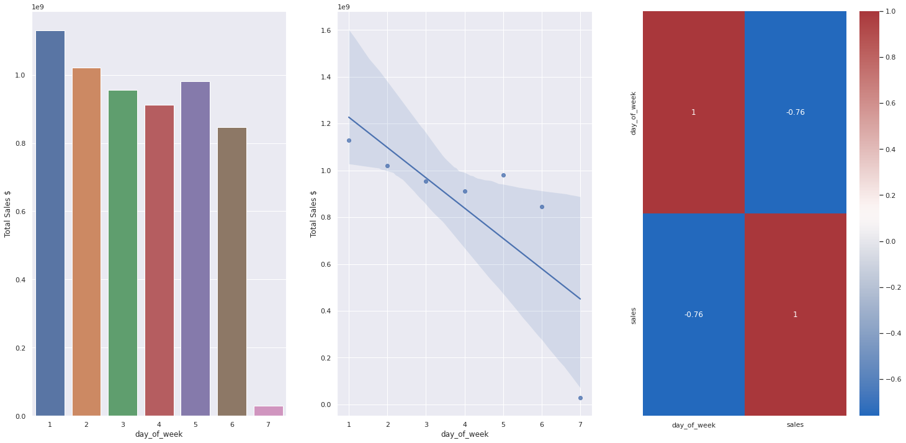
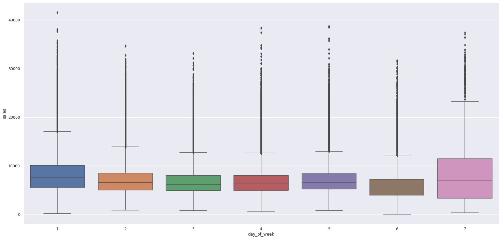
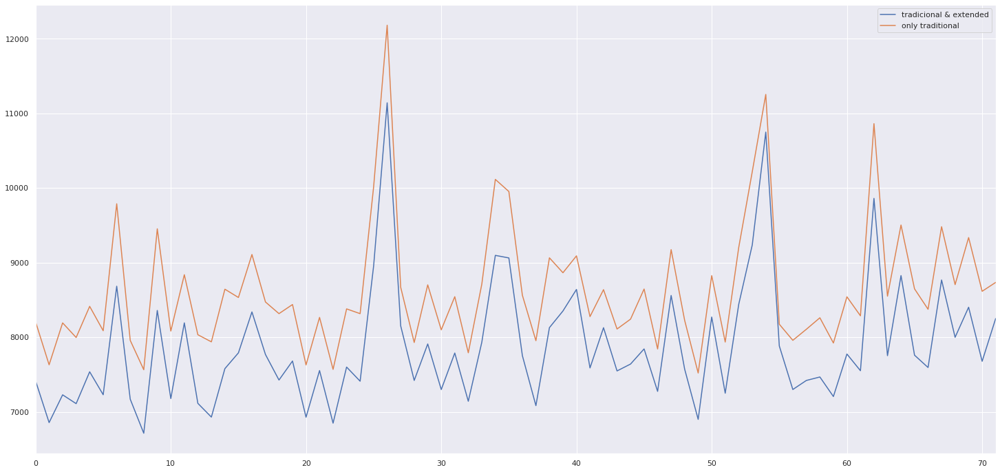
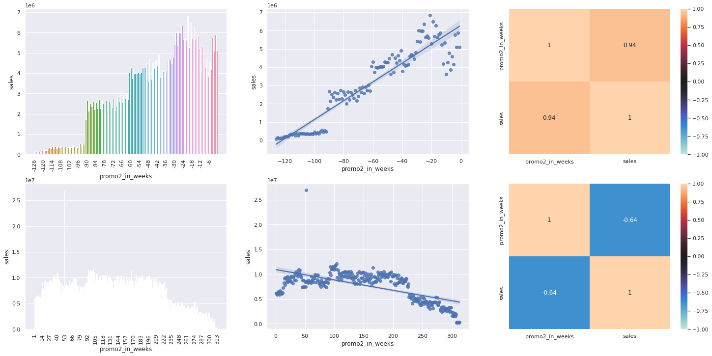
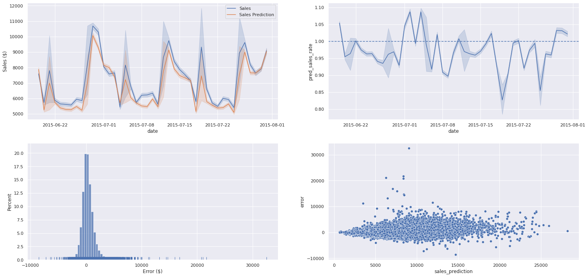

# Rossmmann Stores
## Sales Forecasting the upcoming six weeks

Data Science Project on the Rossmann Dataset

If you wish, you may interact with the final solutions data products I built:

# Business Problem
The business problem this project tries to solve is predicting the sales for each store in the company's database for the upcoming
six weeks.

# Business Assumptions
The motivation for predicting the sales for the next six weeks is being able to predict the upcoming revenue. This offers several advantages for the CFO and management team members when it comes to planning how the company's net income will be spent:
 - On the maintenance and renovation of the existing stores
 - Expanding the company's stores to gain market share
 - Inventory management and stock planning
 - Dividend distribution to shareholders
 - Assessing predictions with operation teams

Assumptions
- Sales have some degree of seasonality and or periodicity that may be captured by machine learning algorithms
- Sales are impacted by store type and the assortment
- Sales are impacted by promotions and extended promotions
- Sales are affected by the competitors' distance

Therefore, if sales can be forecast to some extent, we are interested in it. My main goal in this project was not to build a data science solution that makes decisions for business teams but to build a solution that helps them in this process or at least makes it more comfortable.

# Solution Strategy and Steps Taken

For solving this business problem I used an adaptation of the CRISP-DM methodology, defined by the following steps and chosen solution:

Step 01. Data Description: In this step, I briefly analyzed the data, its variables, and their statistics. In a daily problem, we would be creating database queries and maybe web scraping algorithms to gather data that might be useful.

Step 02. Feature Engineering: Here I tried to create some variables that might help on the understanding and usage of the data, as well as variables that might help M.L. algorithms learn patterns in the data to make predictions.

Step 03. Data Filtering: In this step I: 
- Removed sales with 0 values since they made the sales distribution not normal and we are not interested in predicting 0 sales.
- Filled competition distance NAs with a value higher than max competitor distance available in an attempt to teach the algorithms that these stores' nearest competitors were much further than in stores with competitors nearby.
- Extracted date-time informations to help ML algorithms
- Calculated time since promo2 started in weeks

Step 04. Exploratory Data Analysis: In this step, I studied the distributions of the features and validated some business hypotheses that might be valuable.

Step 05. Data Preparation: In this phase, I applied some transformations as encodings for categorical data and scaling to numerical ones being careful to apply Minmax and Robust rescaling according to the presence or absence of outliers.

Step 06. Feature Selection: Here the Boruta algorithm was used to help select the features that most helped a Tree Algorithm learn the phenomena we're interested in. Boruta works by creating shadow (random) features and comparing if the ML algorithm best learns by using the real or shadow features, and if it learns better using the shadow one it suggests that the feature is not important. 

Step 07. Machine Learning Modelling: In this step I used some linear algorithms as well as some tree-based ones, to verify if the phenomena could be modeled linearly or not.

Step 08. Hyperparameter Fine Tunning: In this phase, I used Bayesian Optimization to find the best hyperparameters for the selected model. Using, of course, cross-validation to be more conservative and make sure the hyperparameters were not overfitting the test dataset.

Step 09. Converting Model Performance to Business Numbers: In this step, using the forecasts I calculated the revenue and how certain the prediction could be, providing a margin of safety for where the real predicted value might be, so that the business team can have an interval to work with.

Step 10. Deploy Modelo to Production: Finally, the ML model was deployed to a cloud service, as an API, so that it can be accessed remotely through POST requests. Additionally, I built a simple telegram bot that accesses the API to return predictions from selected stores to the user, and a simple web app that allows the user to see the sales forecast in a line graph and compare the predictions to historical data.

# Top 3 insights

### **There might be potential in increasing revenue considerably opening stores on Sundays (H10)**

Total sales for each day in 2014
|Week Day|  Sales $|
|-|-|
|1| 421,902,297.00|
|2| 385,086,977.00|
|3| 357,302,036.00|
|4| 334,780,996.00|
|5| 359,487,036.00|
|6| 310,593,431.00|
|7| 11,652,123.00|

If we can increase revenue from sales on Sunday to at least 50\% of the other weekdays average, from \$ 11.6 M to around \$ 180 M, by for example opening stores half period on every Sunday, this would represent an 80\%  increase in annual revenue from \$ 2.165 B to $ 2.345 B.

### **Sales tend to be higher running only "normal" promos, not extended ones. (H6)**

This was a surprise to me, but I were to explain it, I would say this happened probably because running consecutive promos might change customers' perception of price and value, making them believe the products' real price is the promo one.

### **Running extended consecutive promos reduces sales after 100 weeks (H5)**

As we see from the image, before starting extended promos sales were increasing. After an extended promo period started (lower part of the image) sales remained constant and decreased after 100 weeks.

# Machine Learning Applied Models
The models tested were: **Mean, Linear Regression, Linear Regularized Regression (Lasso), Random Forest and Extreme Gradient Boosting Random Forest Regression.**

I tested the mean of past months as a baseline model, considering business teams might use it as an estimate for sales. In this case, I use the mean of each month as a prediction of sales for the next years' months.

I also tested two linear models to see if the sales phenomena could be modeled linearly.

Finally, I tested two tree-based models, since these models are usually able to capture non-linear phenomena.

# Machine Learning Performance
The results of the models providing the full dataset as train data and the last 6 weeks of data as test data are, without fine-tuning, the following:

|Model Name| MAE| MAPE |RMSE|
|-|-|-|-|
|Random Forest| 705.682946  | 0.104120  | 1041.324622|
|XGB Regressor| 861.159813  | 0.126759  | 1234.822895|
|Mean | 1429.763326 | 0.216814  | 1939.328730|
|Linear Regression| 1867.654504 | 0.292836  | 2671.333847|
|Lasso Regression|  1891.463949 | 0.289322  | 2742.922125|

Using Time Series Cross-Validation with 5 folds and maintaining the last 6 weeks of data in each fold for validation the results were:

|Model | MAE CV |MAPE CV |RMSE CV|
|---|---|---|---|
|Linear Regression |    2204.35 +/- 316.89| 0.30 +/- 0.02 | 3191.13 +/- 472.80|
|Lasso Regression | 2258.55 +/- 353.31| 0.30 +/- 0.02 | 3296.99 +/- 537.45|
|Random Forest |    1075.32 +/- 331.57| 0.14 +/- 0.03 | 1629.28 +/- 527.27|
|XGB Regressor |    1116.65 +/- 275.08| 0.15 +/- 0.03 | 1640.10 +/- 435.80|

We may see that the sales variable's behavior is too complex for linear models to grasp. A surprise is that simply calculating the mean (arithmetic average) of sales for each month, and using it as a projection, outperformed the linear models. Finally, among all tested models, tree-based ones performed the best. Therefore I decided to use the XGB Random Forest Regressor since it's a very flexible and performing model and it usually occupies less memory than Random Forests.

Hyperparameter Optimization

For choosing the best hyperparameters I used Bayesian Optimization through the scikit-optimize library's gpminimize function, which uses a Gaussian process for the task. In simple terms, it works by assuming that the objective function, the one we're trying to minimize (usually RMSE after cross-validation), can be approximated by a multivariate gaussian distribution, which in this case is our surrogate function, and that the surrogate function can be optimized through an acquisition function (posterior). More details can be found in this link:

After defining a search space for optimization with 4 hyperparameters and downsampling the dataset with around 10\% of the stores to reduce execution time the result was the following:

|Parameter | Value|
|-|-|
|n_estimators| 223|
|max_depth | 13|
|learning_rate | 0.07|
|min_child_weight | 5|

These parameters resulted in the following cross-validated error for a test dataset of unseen observations:

|Model Name| MAE |  MAPE |  RMSE|
|-|-|-|-|
XGB Tunned| 648.586815| 0.093679    |951.620026|

# Business Results

To evaluate the results from a business perspective I considered that the prediction could fluctuate between + - the sum of predictions * MAPE (mean absolute percentage error) for each store. In other words, that the prediction would lie within the range of the MAPE either way (up or down).

Below are a few samples of the predictions for the last 6 weeks of sales (unseen data of the test dataset)

|store  |sales_prediction   |best_scenario  |worst_scenario|    MAPE |  MAE |
|-|-|-|-|-|-|
|266 |  154,721.03 |    170,340.41 |    139,101.66 |    0.100952 |  409.712158|
|102 |  244,210.56 |    270,188.37 |    218,232.76 |    0.106375 |  752.815984|
|1046 | 307,952.31 |    336,752.86 |    279,151.76 |    0.093523 |  874.730944|
|793 |  171,992.42 |    190,731.26 |    153,253.58 |    0.108952 |  519.433871|
|903 |  329,706.25 |    414,229.13 |    245,183.37 |    0.256358 |  3143.479980|

The image below is the performance of our machine learning model:

From the 4 plots, we can see that, respectively:

- Sales predictions (orange line) lie well within the real sales, however not close enough to be overfitting.
- The ratio between predictions/actual values is mostly below 1 and therefore, the model is "undershooting" or "underpredicting" the real values a little bit in some periods.
- The errors are normally distributed, which means the model is not committing significant errors when predicting the sales. In other others, the errors are, on average, near zero.
- Errors do not increase as the predicted values increase (there is not much variation in the errors), so the model is not biased for either low or high prediction values.

8 Conclusions
Finishing this first iteration in the CRISP cycle I built and deployed three applications to help others use my work:
- A Flask API to receive POST requests with data from a store and return a prediction
- A Telegram bot that replies to the user with the sales prediction for any store the user sends to it
- A Streamlit web app that allows the user to visualize sales predictions of the next six weeks, both graphically and numerically, for any store and compare it to a past time frame so that the user might have an idea if the prediction makes sense or not.

These 3 applications were deployed to a free cloud service (Heroku). The two apps work by making POST requests to the Flask API and you may interact with them through the links:

# Lessons Learned
- ALWAYS comment on your code explaining what you are doing and why! Even if the comments may seem too elementary at the moment, later you probably won't remember everything the code does or why you choose some alternative to solve a problem. And of course, if you expect your code to be reviewed or complemented by others, they have to understand what you did as well.
- Saving the processed data and reading it later, instead of running the code snippets again, does save a lot of time, mainly if not much processing power is at your disposal or the data volume is relatively high.
- Experimenting with the code may give insights on doing things differently, but it must not take forever. Remember Done is better than perfect.
- Exploratory data analysis provides not only important information about data and insights to the business team but also an understanding of how some features might help or not the chosen ML models.
- Models must be chosen while keeping in mind the deployment costs. Sometimes the performance difference won't make up for the costs.

# Next Steps

In the next CRISP cycle I would probably consider:
- Building a proper pipeline to speed up the process of experimenting with data
- Iterating more on the hyperparameter fine tunning and experiment with more hyperparameters
- Test other ML models
- Compute an ANOVA test to check if the fact that stores of type "b" are overperforming other type ones (as seen in hypothesis 1) is statistically significant. 

# Author
Humberto Aguiar de Souza Filho.

If I can be of assistance, or you have any suggestions please do not hesitate to contact me:

